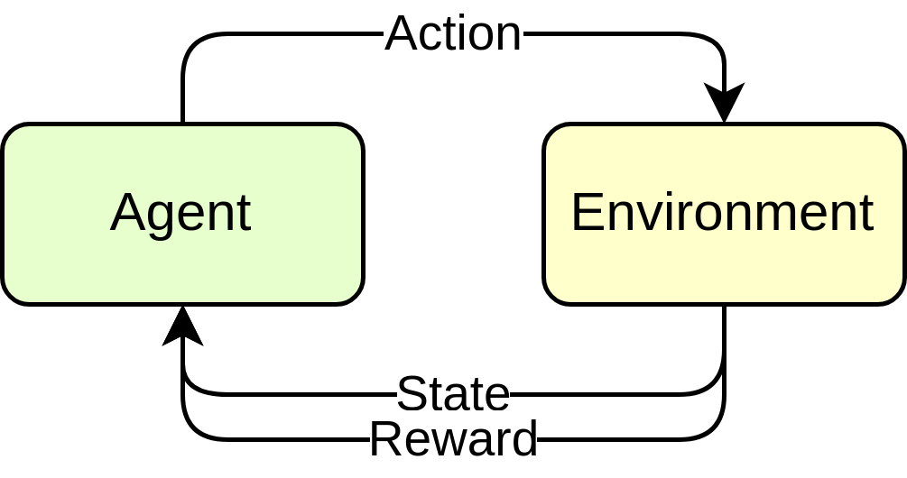
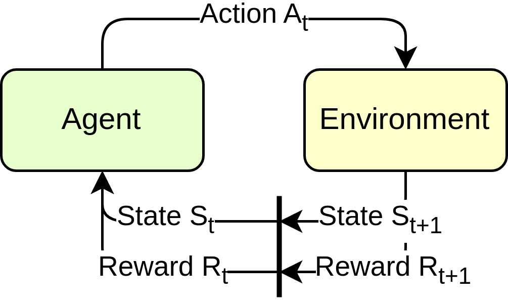

---
title:

- Reinforcement Learning for Deliberation in ROS 2
author:
- Christian Henkel
- Sebastian Castro
theme:
- Bergen
date:
- ROSCon 2025 / October 27, 2025
logo:
- ros-wg-delib.png
aspectratio: 169
header-includes:
- \hypersetup{colorlinks=true}
- \setbeamersize{sidebar width left=0.175\paperwidth}
pandoc-beamer-block:
- classes: [info]
- classes: [alert]
  type: alert
---

# Agenda

<!-- ## Schedule -->

| __Time__       | __Topic__                                               |
|----------------|---------------------------------------------------------|
| 13:00 - 13:30  | Introduction / Software Setup                           |
| 13:30 - 14:00  | (Very) Quick intro to Reinforcement Learning            |
| 14:00 - 15:00  | Training and evaluating RL agents                       |
| 15:00 - 15:30  | [Coffee break / leave a longer training running]        |
| 15:30 - 16:15  | Evaluating trained agents and running in ROS nodes      |
| 16:15 - 17:00  | Discussion: ROS 2, RL, and Deliberation                 |

# Software Setup

1. Clone the repository

    ```bash
    git clone --recursive \
      https://github.com/ros-wg-delib/rl_deliberation.git
    ```

2. Install Pixi:

    ```bash
    curl -fsSL https://pixi.sh/install.sh | sh
    ```

    (or \href{https://pixi.sh/latest/installation}{\texttt{https://pixi.sh/latest/installation}} – recommend autocompletion!)

3. Build the project:

    ```bash
    pixi run build
    ```

4. Run an example:

    ```bash
    pixi run start_world --env GreenhousePlain
    ```

# Introduction

::: columns

:::: column
__What is Reinforcement Learning (RL)?__

---

Basic model:

- Given an __agent__ and an __environment__.
- Subject to the __state__ of the environment,
- the agent takes an __action__.
- the environment responds with a new __state__ and a __reward__.

::::

:::: column


See also [Sutton and Barto, Reinforcement Learning: An Introduction](http://incompleteideas.net/book/RLbook2020.pdf)
::::

:::

# Introduction: Notation

::: columns

:::: column

- Discrete time steps $t = 0, 1, 2, \dots$
- The environment is in a __state $S_t$__
- Agent performs an __action $A_t$__
- Environment responds with a new state $S_{t+1}$ and a reward $R_{t+1}$
- Based on that $S_t$ the agent selects the __next action__ $A_{t+1}$

<!-- ---

The goal of this _learning problem_ is to maximize the __cumulative reward__ over time:
$$
R_t = \sum_{k=0}^{\infty} \gamma^k r_{t+k+1},
$$
where $\gamma$ is a discount factor. -->
::::

:::: column

::::

:::

# Example 1: You are the agent

Start by exploring the environment.

```bash
pixi run start_world --env GreenhousePlain
```

Then, in another terminal, run:

```bash
pixi run eval_manual  # TODO
```

# Introduction: Environment = MDP

## MDP

We assume the environment to be a __Markov Decision Process (MDP)__.
An MDP is defined as $< \mathcal{S}, \mathcal{A}, \mathcal{P}, \mathcal{R}>$.

- $s \in \mathcal{S}$ states and $a \in \mathcal{A}$ actions as above.
- $\mathcal{P}$ State Transition Probability: $P(s'|s, a)$.
  - For an action $a$ taken in state $s$, what is the probability of reaching state $s'$?
- $\mathcal{R}$ Reward Function: $R(s, a)$.
  - We will use this to motivate the agent to learn desired behavior.

Implicit to the above is the __Markov Property__:

The future state $S_{t+1}$ depends only on the current state $S_t$
and action $A_t$, not on the sequence of events that preceded it.

# Introduction: Agent = Policy

## Policy

The agent's behavior is defined by a __policy__ $\pi$.
A policy is a mapping from states to actions: $\pi: \mathcal{S} \rightarrow \mathcal{A}$.

## Reminder

We are trying to optimize the __cumulative reward__ (or __return__) over time:

$$
G_t = R_0 + R_1 + R_2 + \dots
$$

In practice, we use a __discount factor__ $\gamma \in [0, 1]$ to prioritize immediate rewards:

$$
G_t = R_0 + \gamma R_1 + \gamma^2 R_2 + \dots
$$
$$
G_t = \sum_{k=0}^{\infty} \gamma^k R_{t+k}
$$


# Introduction: Learning

How do we learn a good policy?

## Bellman Equation

This is probably the __most fundamental equation in RL__.
It assigns a value to each state $s$ under a policy $\pi$:

$$v_{\pi}(s) = \mathbb{E}_{\pi} [G_t | S_t = s]$$
$$ = \mathbb{E}_{\pi} [R_{t+1} + \gamma v_{\pi}(S_{t+1}) | S_t = s]$$
$$ = \sum_{a} \pi(a|s) \sum_{s', r} p(s', r | s, a) [r + \gamma v_{\pi}(s')]$$

Here, $v_{\pi}(s)$ is known as the __state value function__.

# Introduction: Temporal Differencing

The Bellman equation gives rise to __temporal differencing (TD)__ for training a policy.

$$v_{\pi}(S_t) \leftarrow (1 - \alpha) v_{\pi}(S_t) + \alpha (R_{t+1} + \gamma v_{\pi}(S_{t+1}))$$

where

* $v_{\pi}(S_t)$ is the expected value of state $S_t$
* $R_{t+1} + \gamma v_{\pi}(S_{t+1})$ is the actual reward obtained at $S_t$ plus the expected value of the next state $S_{t+1}$
* $R_{t+1} + \gamma v_{\pi}(S_{t+1}) - v_{\pi}(S_t)$ is the __TD error__.

\footnotesize (a variant using the __state-action value function__ $Q_{\pi}(s, a)$ is known as __Q-learning__.)

# Reference: Reinforcement Learning Algorithms

## \footnotesize Deep Q Network (DQN)

Learns a Q-function $Q(s, a)$.
Introduced _experience replay_ (off-policy) and _target networks_.
[Mnih et al., 2013](https://arxiv.org/abs/1312.5602), [Mnih et al., 2015](https://www.nature.com/articles/nature14236), [SB3 docs](https://stable-baselines3.readthedocs.io/en/master/modules/dqn.html)


## \footnotesize Advantage Actor-Critic (A2C)

Introduced the _advantage function_ $A(s, a) = Q(s, a) - V(s)$ to reduce variance.
[Mnih et al., 2016](https://arxiv.org/abs/1602.01783), [SB3 docs](https://stable-baselines3.readthedocs.io/en/master/modules/a2c.html)

## \footnotesize Proximal Policy Optimization (PPO)

Optimize policy directly. Uses a _clipped surrogate objective_ to ensure stability.
[Schulman et al., 2017](https://arxiv.org/abs/1707.06347), [SB3 docs](https://stable-baselines3.readthedocs.io/en/master/modules/ppo.html)

## \footnotesize Soft Actor-Critic (SAC)

Off-policy algorithm encouraging exploration with _entropy_ term.
[Haarnoja et al., 2018](https://arxiv.org/abs/1801.01290), [SB3 docs](https://stable-baselines3.readthedocs.io/en/master/modules/sac.html)

# The Greenhouse Environment

pixi run start_world with GreenhousePlain

Run with a random agent

Explore the code to see how the gymnasium env is set up (reset + step)

# Training Your First Agent

pixi run train

… this is going to take a while

start the model headless and run as quickly as possible instead!

Seeding is important for reproducibility!

# Visualizing Training Progress

Launch Tensorboard and make sense of it

pixi run tensorboard

# Evaluating Your Agent

pixi run eval --model MyModel.pt

# Train More Complicated Environment Variations

Introduce GreenhouseRandom and GreenhouseBattery subtypes

# Deploying a Trained Policy as a ROS Node

pixi run policy_node --model MyModel.pt

# Discussion: ROS, RL, and Deliberation

Introduce some of the main points in this slide

* Hyperparameter tuning and scaling up experiments
* Deploying real policies to ROS
* Comparing RL for control with RL for deliberation

# Resources

## RL theory

* Sutton + Barto Textbook: http://incompleteideas.net/book/the-book-2nd.html
* David Silver Lectures: https://davidstarsilver.wordpress.com/teaching/

## Deliberation

* ROS Deliberation Community Group: https://github.com/ros-wg-delib
* Workshop Repo: https://github.com/ros-wg-delib/rl_deliberation
