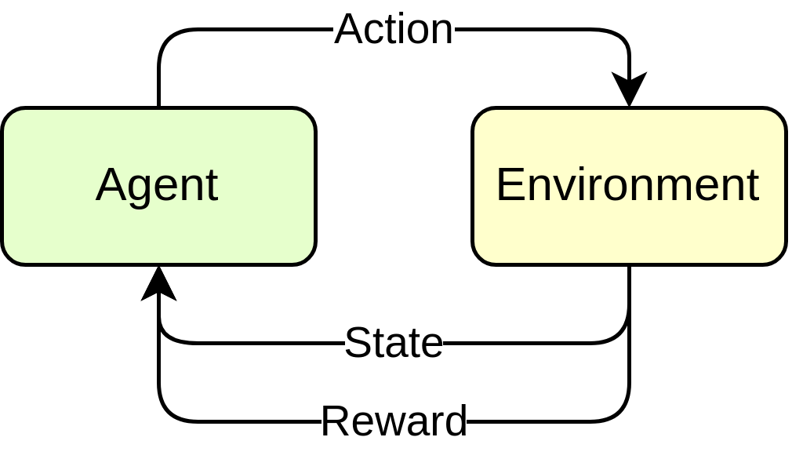
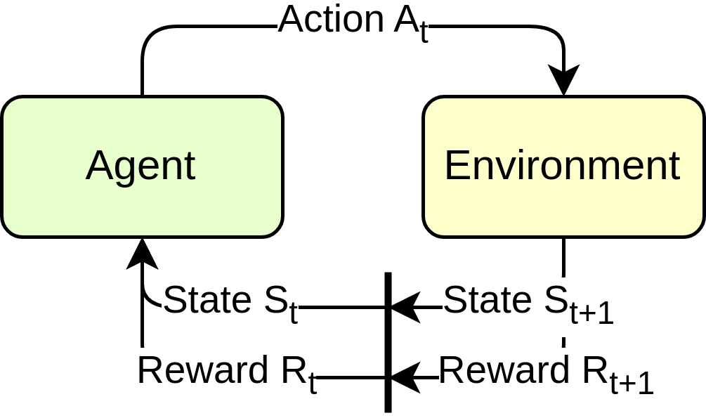
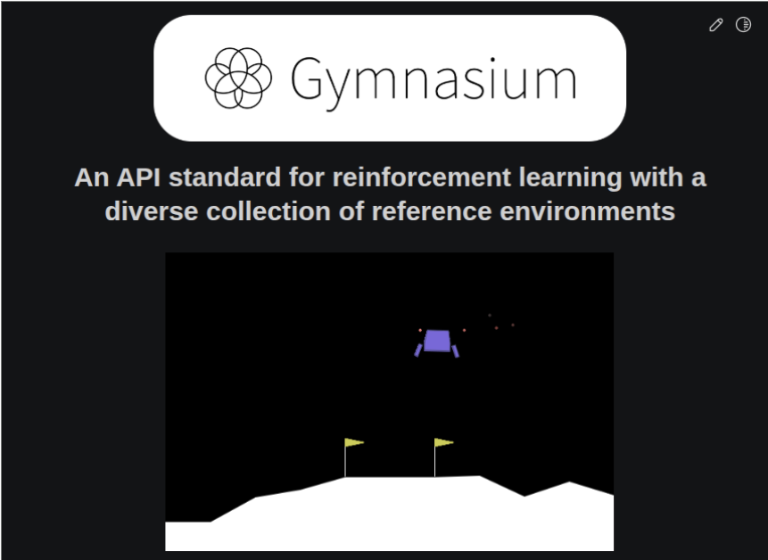
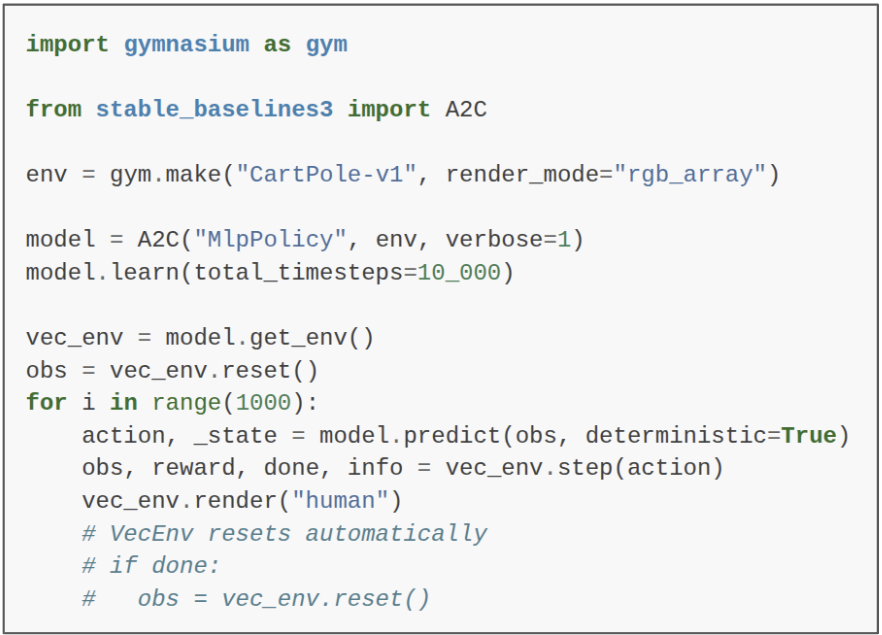
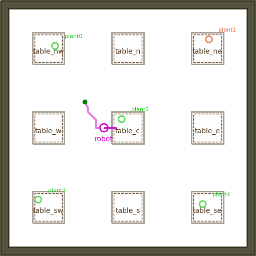
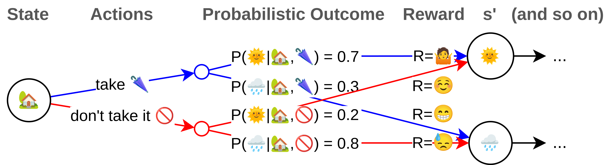
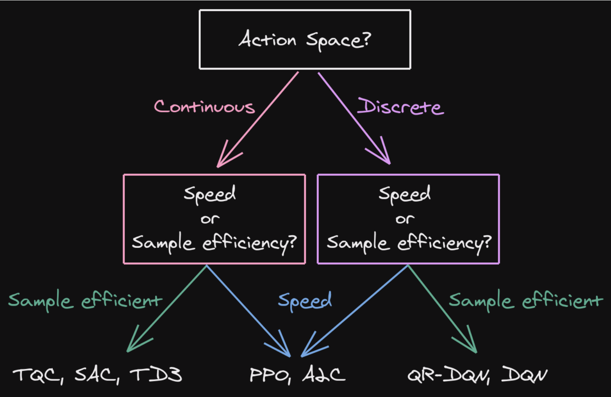
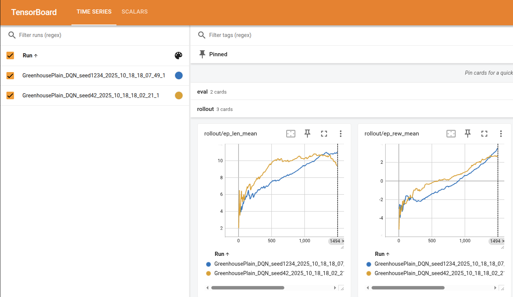
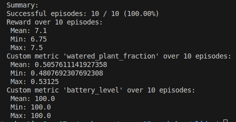
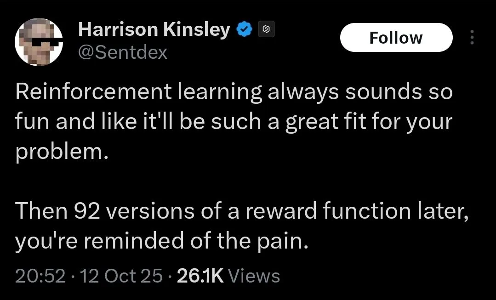

---
title:
- Reinforcement Learning for Deliberation in ROS 2
author:
- Christian Henkel
- Sebastian Castro
theme:
- Bergen
date:
- ROSCon 2025 / October 27, 2025
aspectratio: 169
fontsize: 10pt
colorlinks: true
indent: false
header-includes:
  - \usepackage{listings}
  - \usepackage{xcolor}
  - \lstset{
      basicstyle=\ttfamily\small,
      backgroundcolor=\color{gray!10},
      keywordstyle=\color{blue},
      stringstyle=\color{orange},
      commentstyle=\color{gray},
      showstringspaces=false
    }
  - \hypersetup{urlcolor=blue}
  - \urlstyle{tt}
  - \setbeamerfont{footline}{size=\normalsize}
  - \setbeamertemplate{navigation symbols}{}
  - \setbeamertemplate{footline}{\vspace{2pt} \hspace{2pt} \includegraphics[width=1.85cm]{media/ros-wg-delib.png} \includegraphics[width=1.85cm]{media/roscon25.png} \hspace*{5pt} \insertsection \hfill \insertframenumber{} / \inserttotalframenumber \hspace*{5pt} \vspace{2pt}}
---

# Introduction

## Agenda

| __Time__       | __Topic__                                               |
|----------------|---------------------------------------------------------|
| 13:00 - 13:30  | Introduction / Software Setup                           |
| 13:30 - 14:00  | (Very) Quick intro to Reinforcement Learning            |
| 14:00 - 15:00  | Training and evaluating RL agents                       |
| 15:00 - 15:30  | [Coffee break / leave a longer training running]        |
| 15:30 - 16:15  | Evaluating trained agents and running in ROS nodes      |
| 16:15 - 17:00  | Discussion: ROS 2, RL, and Deliberation                 |

## Software Setup

1. Clone the repository

    ```bash
    git clone --recursive \
      https://github.com/ros-wg-delib/rl_deliberation.git
    ```

2. Install Pixi:

    ```bash
    curl -fsSL https://pixi.sh/install.sh | sh
    ```

    (or <https://pixi.sh/latest/installation> – recommend for autocompletion!)

3. Build the project:

    ```bash
    pixi run build
    ```

4. Run an example:

    ```plain
    pixi run start_world --env GreenhousePlain
    ```

## Learning Goals

By the end of this workshop, you will be able to:

- Recognize robotics problems that can be solved with reinforcement learning.
- Understand the basic reinforcement learning concepts and terminology.
- Observe the effects of changing algorithms, hyperparameters, and reward functions on training.

## What is Reinforcement Learning (RL)?

::: columns

:::: column

### Basic model

- Given an __agent__ and an __environment__.
- Subject to the __state__ of the environment,
- the agent takes an __action__.
- the environment responds with a new __state__ and a __reward__.

::::

:::: column


See also [Sutton and Barto, Reinforcement Learning: An Introduction](http://incompleteideas.net/book/RLbook2020.pdf)
::::

:::

## What is Reinforcement Learning (RL)?

### Notation

::: columns

:::: column

- Discrete time steps $t = 0, 1, 2, \dots$
- The environment is in a __state $S_t$__
- Agent performs an __action $A_t$__
- Environment responds with a new state $S_{t+1}$ and a reward $R_{t+1}$
- Based on that $S_t$ the agent selects the __next action__ $A_{t+1}$

::::

:::: column

::::

:::

## RL Software in this Workshop

::: columns

:::: column



\footnotesize Represents environments for RL <https://gymnasium.farama.org/>

::::

:::: column



\footnotesize RL algorithm implementations in PyTorch <https://github.com/DLR-RM/stable-baselines3>

::::

:::

## Exercise 1: You are the agent

::: columns

:::: {.column width=40%}

Start the environment:

```plain
pixi run start_world  \
  --env GreenhousePlain
```

{height=100px}

__Welcome__  
You are a robot that has to water plants in a greenhouse

::::

:::: {.column width=60%}

Then, in another terminal, run:

```plain
pixi run eval --model manual \
  --env GreenhousePlain \
  --config \
  greenhouse_env_config.yaml
```

```plain
Enter action from [0, 1]:
```

On this prompt, you can choose:

- __0__: Move forward without watering, or
- __1__: Water the plant and move on.  

---

But be __careful__: If you try to water the evil plant _(red)_, you will be eaten.
  
{width=80px}

::::

:::

# Concepts

## Environment = MDP

### MDP

We assume the environment to follow a __Markov Decision Process (MDP)__ model.  
An MDP is defined as $< \mathcal{S}, \mathcal{A}, \mathcal{P}, \mathcal{R}>$.

- $s \in \mathcal{S}$ states and $a \in \mathcal{A}$ actions as above.
- $\mathcal{P}$ State Transition Probability: $P(s'|s, a)$.
  - For an action $a$ taken in state $s$, what is the probability of reaching state $s'$?
- $\mathcal{R}$ Reward Function: $R(s, a)$.
  - We will use this to motivate the agent to learn desired behavior.

{height=90px}

## Markovian

### Markov Property

Implicit to the MDP formulation is the __Markov Property__:

The future state $S_{t+1}$ depends only on the current state $S_t$ and action $A_t$,  
not on the sequence of events that preceded it.

### Practical implication

Not a direct limitation for practical use, but something to be aware of.

- E.g., if history matters, include it in the state representation.
- However, this will not make learning easier.

## Agent = Policy

### Policy

The agent's behavior is defined by a __policy__ $\pi$.
A policy is a mapping from states to actions: $\pi: \mathcal{S} \rightarrow \mathcal{A}$.

### Reminder

We are trying to optimize the __cumulative reward__ (or __return__) over time:

$$
G_t = R_0 + R_1 + R_2 + \dots
$$

In practice, we use a __discount factor__ $\gamma \in [0, 1]$ to prioritize immediate rewards:

$$
G_t = R_0 + \gamma R_1 + \gamma^2 R_2 + \dots
$$
$$
G_t = \sum_{k=0}^{\infty} \gamma^k R_{t+k}
$$

## Learning

### Bellman Equation

This is probably the __most fundamental equation in RL__.
It estimates $v_{\pi}(s)$, known as the __state value function__ when using policy $\pi$:

$$v_{\pi}(s) = \mathbb{E}_{\pi} [G_t | S_t = s]$$
$$ = \mathbb{E}_{\pi} [R_{t+1} + \gamma v_{\pi}(S_{t+1}) | S_t = s]$$
$$ = \sum_{a} \pi(a|s) \sum_{s', r} p(s', r | s, a) [r + \gamma v_{\pi}(s')]$$

### Fundamental optimization goal

So, we can formulate the problem to find an optimal policy $\pi^*$ as an optimization problem:

$$\pi^* = \arg\max_{\pi} v_{\pi}(s), \quad \forall s \in \mathcal{S}$$

# Methods

## Temporal Differencing

The Bellman equation gives rise to __temporal differencing (TD)__ for training a policy.

$$v_{\pi}(S_t) \leftarrow (1 - \alpha) v_{\pi}(S_t) + \alpha (R_{t+1} + \gamma v_{\pi}(S_{t+1}))$$

where

- $v_{\pi}(S_t)$ is the expected value of state $S_t$
- $R_{t+1} + \gamma v_{\pi}(S_{t+1})$ is the actual reward obtained at $S_t$ plus the expected value of the next state $S_{t+1}$
- $R_{t+1} + \gamma v_{\pi}(S_{t+1}) - v_{\pi}(S_t)$ is the __TD error__.
- $\alpha$ is the __learning rate__.

\small (a variant using the __state-action value function__ $Q_{\pi}(s, a)$  
\small is known as __Q-learning__.)

## Tabular Reinforcement Learning

RL began with known MDPs + discrete states/actions, so $v_{\pi}(s)$ or $q_{\pi}(s,a)$ are __tables__.

)](media/grid-world.png){width=150px}

Can use __dynamic programming__ to iterate through the entire environment and converge on an optimal policy.

::: columns

:::: column

)](media/value-iteration.png){width=80px}

::::

:::: column

)](media/policy-iteration.png){width=80px}

::::

:::

## Model-Free Reinforcement Learning

If the state-action space is too large, need to perform __rollouts__ to gain experience.

Key: Balancing __exploitation__ and __exploration__!

)](media/model-free-rl.png){width=430px}

## Deep Reinforcement Learning

When the observation space is too large (or worse, continuous), tabular methods no longer work.

Need a different function approximator -- _...why not a neural network?_

)](media/dqn.png){width=250px}

__Off-policy__: Can train on old experiences from a _replay buffer_.

## Actor-Critic / Policy Gradient Methods

DQN only works for discrete actions, so what about continuous actions?  

::: columns

:::: {.column width=60%}

- __Critic__ approximates value function. Trained via TD learning.

- __Actor__ outputs actions (i.e., the policy). Trained via __policy gradient__, backpropagated from critic loss.

---

- Initial methods were __on-policy__ -- can only train on the latest version of the policy with current experiences.
Example: Proximal Policy Optimization (PPO) ([Schulman et al., 2017](https://arxiv.org/abs/1707.06347)).

- Other approaches train actor and critic at different time scales to allow off-policy.
Example: Soft Actor-Critic (SAC) ([Haarnoja et al., 2018](https://arxiv.org/abs/1801.01290)).

::::

:::: {.column width=40%}

)](media/actor-critic.png){width=160px}

::::
:::

## Concept Comparison

::: columns
:::: {.column width=45%}

### Exploitation vs. Exploration

__Exploitation__: Based on the current policy, select the action that maximizes expected reward.

__Exploration__: Select actions that may not maximize immediate reward, but could lead to better long-term outcomes.

### On-policy vs. Off-policy

__On-policy__: Learn the value of the policy being carried out by the agent.

__Off-policy__: Learn the value of an optimal policy independently of the agent's actions.
::::

:::: {.column width=55%}
Benefits of __on-policy__ methods:

$-$ Collect data that is relevant under the current policy.

$-$ More stable learning.

---

Benefits of __off-policy__ methods:

$-$ Better sample efficiency.

$-$ Relevant for real-world robotics (gathering data is expensive).

::::

:::

## Available Algorithms

### DQN

__Deep Q Network__

::: columns
:::: {.column width=50%}
\small
Learns a Q-function $Q(s, a)$. Introduced _experience replay_ and _target networks_.
::::
:::: {.column width=25%}
\small
Off-policy  
Discrete actions
::::
:::: {.column width=25%}
\small
[Mnih et al., 2013](https://arxiv.org/abs/1312.5602)  
[SB3 docs](https://stable-baselines3.readthedocs.io/en/master/modules/dqn.html)
::::
:::

### A2C

__Advantage Actor-Critic__

::: columns
:::: {.column width=50%}
\small
$A(s, a) = Q(s, a) - V(s)$ _advantage function_ to reduce variance.
::::
:::: {.column width=25%}
\small
On-policy  
Any action space
::::
:::: {.column width=25%}
\small
[Mnih et al., 2016](https://arxiv.org/abs/1602.01783)  
[SB3 docs](https://stable-baselines3.readthedocs.io/en/master/modules/a2c.html)
::::
:::

### PPO

__Proximal Policy Optimization__

::: columns
:::: {.column width=50%}
\small
Optimize policy directly. Uses a _clipped surrogate objective_ for stability.
::::
:::: {.column width=25%}
\small
On-policy  
Any action space
::::
:::: {.column width=25%}
\small
[Schulman et al., 2017](https://arxiv.org/abs/1707.06347) [SB3 docs](https://stable-baselines3.readthedocs.io/en/master/modules/ppo.html)
::::
:::

### SAC

__Soft Actor-Critic__

::: columns
:::: {.column width=50%}
\small
Separate Actor & Critic NNs. Exploration by additional _entropy_ term.
::::
:::: {.column width=25%}
\small
Off-policy  
Cont. actions
::::
:::: {.column width=25%}
\small
[Haarnoja et al., 2018](https://arxiv.org/abs/1801.01290)  
[SB3 docs](https://stable-baselines3.readthedocs.io/en/master/modules/sac.html)
:::::
:::

## Which Algorithm to Choose?

From the lead developer of SB3 (Antonin Raffin): <https://araffin.github.io/slides/rlvs-tips-tricks/>

{width=300px}

# Exercises

## Exercise 2: Run with a Random Agent

```plain
pixi run start_world --env GreenhousePlain

pixi run eval --realtime \
  --config greenhouse_env_config.yaml --model \
  pyrobosim_ros_gym/policies/GreenhousePlain_DQN_random.pt
```

{height=150px}

## Exercise 3: Training Your First Agent

Start the world.

```plain
pixi run start_world --env GreenhousePlain
```

Kick off training.

```plain
pixi run train --config greenhouse_env_config.yaml \
  --env GreenhousePlain --algorithm DQN \
  --discrete-actions --realtime
```

The `--config` file points to `pyrobosim_ros_gym/config/greenhouse_env_config.yaml`, which lets you easily set up different algorithms and training parameters.

## Exercise 3: Training Your First Agent (For Real...)

... this is going to take a while.
Let's speed things up.

Run simulation headless, i.e., without the GUI.

Without "realtime", run actions as fast as possible

```plain
pixi run train --config greenhouse_env_config.yaml \
  --env GreenhousePlain --algorithm DQN --discrete-actions
```

__NOTE:__ Seeding the training run is important for reproducibility!

We are running with `--seed 42` by default, but you can change it.

## Exercise 3: Visualizing Training Progress

SB3 has visualization support for [TensorBoard](https://www.tensorflow.org/tensorboard).
By adding the `--log` argument, a log file will be written to the `train_logs` folder.

```plain
pixi run train --config greenhouse_env_config.yaml \
  --env GreenhousePlain --algorithm DQN \
  --discrete-actions --log
```

Open TensorBoard and follow the URL (usually `http://localhost:6006/`).

```plain
pixi run tensorboard
```

{width=200px}

## Exercise 3: Evaluating Your Trained Agent

Once you have your trained model, you can evaluate it against the simulator.

```plain
pixi run eval --config greenhouse_env_config.yaml \
  --model <path_to_your_model>.pt --num-episodes 10
```

By default, this will run just like training (as quickly as possible).

You can add the `--realtime` flag to slow things down to "real-time" so you can visually inspect the results.

{width=240px}

## Exercise 4: Train More Complicated Environments

\small Training the `GreenhousePlain` environment is easy because the environment is _deterministic_; the plants are always in the same locations.

For harder environments, you may want to switch algorithms (e.g., `PPO` or `SAC`).

::: columns

:::: column

{width=120px}

Plants are now spawned in random locations -- but only one per table.

::::

::: column

{width=120px}

Watering costs 49% battery -- must recharge after watering twice.

Charging is a new action (id `3`).

::::

:::

__Challenge__: Evaluate your policy on the `GreenhouseRandom` environment!

## Application: Deploying a Trained Policy as a ROS Node

1. Start an environment of your choice.

```plain
pixi run start_world --env GreenhouseRandom
```

2. Start the node with an appropriate model.

```plain
pixi run policy_node --model <path_to_your_model>.pt \
  --config greenhouse_env_config.yaml
```

3. Open an interactive shell.

```plain
pixi shell
```

4. In the shell, send an action goal to run the policy to completion!

```plain
ros2 action send_goal /execute_policy \
  rl_interfaces/ExecutePolicy {}
```

# Discussion

## When to use RL?

Arguably, our simple greenhouse problem did not need RL.

... but it was nice and educational... right?

### General rules

- If easy to model, __engineer it by hand__ (e.g., controllers, behavior trees).
- If difficult to model, but you can provide the answer (e.g., labels or demonstrations), consider __supervised learning__.
- If difficult to model, and you cannot easily provide an answer, consider __reinforcement learning__.

## Scaling up Learning

### Parallel simulation

::: columns

:::: column

- Simulations can be parallelized using multiple CPUs / GPUs.

- SB3 defaults to using __vectorized environments__.

- Other tools for parallel RL include [NVIDIA Isaac Lab](https://github.com/isaac-sim/IsaacLab) and [mjlab](https://github.com/mujocolab/mjlab).

::::

:::: column

](media/rsl-parallel-sim.png){height=90px}

::::

:::

## Curriculum learning

::: columns

:::: column

- __Reward shaping__ by itself is very important to speed up learning.

- Rather than solving the hardest problem from scratch, introduce a __curriculum__ of progressively harder tasks.

::::

:::: column

](media/curriculum-learning.png){height=100px}

::::

:::

## RL Experimentation

### RNG Seeds

::: columns

:::: column

- It is possible to get a "lucky" (or "unlucky") seed when training.

- Best (and expected) practice is to run multiple experiments and report intervals.

::::

:::: column

](media/ppo-graph.png){height=90px}

::::

:::

## Hyperparameter Tuning

::: columns

:::: column

### Hyperparameter

- Any user-specified parameter for ML training.

- e.g., learning rate, batch/network size, reward weights, ...

- Consider using automated tools (e.g., [Optuna](https://github.com/optuna/optuna)) to help you tune hyperparameters.

::::

:::: column

](media/optuna-dashboard.png){height=90px}

::::

:::

## Deploying Policies to ROS

::: columns

:::: {.column width=40%}

### Python

- Can directly put PyTorch / Tensorflow / etc. models in a `rclpy` node.
- Be careful with threading and CPU/GPU synchronization issues!

### C++

- If you need performance, consider using C++ for inference.
- Facilitated by tools like [ONNX Runtime](https://onnxruntime.ai/inference).
- Can also put your policy inside a `ros2_control` controller for real-time capabilities.

::::

:::: {.column width=60%}

](media/pytorch-threading-question.png){height=120px}

](media/onnx-runtime.png){height=100px}

::::

:::

## RL for Deliberation

### Background

__State of the art RL works for fast, low-level control policies (e.g., locomotion)__

- Requires sim-to-real training because on-robot RL is hard and/or unsafe.
- Alternatives: fine-tune pretrained policies or train _residual_ policies.

### Deliberation

__How does this change for deliberation applications?__

- Facilitates on-robot RL: train high-level decision making, add a safety layer below.
- Hierarchical RL dates back to the __options framework__ ([Sutton et al., 1998](http://incompleteideas.net/609%20dropbox/other%20readings%20and%20resources/Options.pdf)).
- What kinds of high-level decisions can/should be learned?
- What should this "safety layer" below look like?

## Further Resources

### RL Theory

- \small Sutton & Barto Textbook: <http://incompleteideas.net/book/the-book-2nd.html>
- \small David Silver Lectures: <https://davidstarsilver.wordpress.com/teaching/>
- \small Stable Baselines3 docs: <https://stable-baselines3.readthedocs.io/>

### ROS Deliberation

<https://github.com/ros-wg-delib>

Join our mailing list and ~monthly meetings!

{height=100px}
